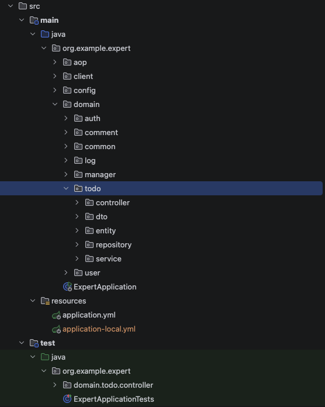

# SPRING PLUS

# 프로젝트 소개
이 프로젝트는 내일배움캠프 SPRING PLUS 강좌의 코드 개선 과제입니다.  
Spring Boot 기반의 3-Layer Architecture(Controller–Service–Repository)를 적용한 프로젝트에서  
발견된 오류를 단계별로 수정하고 코드 품질을 향상시키는 작업을 수행했습니다.  
주요 목표는 코드 리팩토링, 성능 개선, 테스트 코드, QueryDSL 사용, 안정화입니다.

## 수행한 과제

### Lv.1 - 코드 품질 개선
- 1. @Transactional의 이해 - `@Transactional(readOnly = true)` 환경에서 쓰기 작업 시 발생하는 에러 수정
- 2. JWT의 이해 - User 테이블에 nickname 컬럼 추가 및 JWT 토큰에 닉네임 포함
- 3. JPA의 이해 - `weather` 조건 및 수정일 기준 기간 검색 기능 추가 (JPQL 동적 쿼리)
- 4. 컨트롤러 테스트의 이해 - 실패하는 테스트 코드 수정
- 5. AOP의 이해 - AOP가 올바른 메서드에 동작하도록 수정

### Lv.2 - 코드 품질 개선
- 6. JPA Cascade - 할 일 저장 시 생성한 유저가 담당자로 자동 등록되도록 수정
- 7. N+1 - `@EntityGraph` 또는 fetch join으로 N+1 문제 해결
- 8. QueryDSL - JPQL로 작성된 쿼리를 QueryDSL로 변환
- 9. Spring Security - 기존 Filter, ArgumentResolver 방식을 Spring Security로 전환

### Lv.3 - 도전 기능
- 10. QueryDSL 검색 기능 - BooleanBuilder, Projections, PageImpl을 활용한 동적 쿼리 검색 API 구현
- 11. Transaction 심화 - `REQUIRES_NEW`로 매니저 등록과 로그 기록을 독립적인 트랜잭션으로 처리

## 기술 스택
- Language: Java 17
- Framework: Spring Boot 3.3.3
- Persistence: Spring Data JPA + MySQL
- Build Tool: Gradle
- Environment: Web Application (REST API)

## 프로젝트 구조 (주요 패키지)

## 트러블 슈팅(Velog 주소)
https://velog.io/@jhsky3118/Troubleshooting-Spring-Plus-%EA%B3%BC%EC%A0%9C26.04.06

## 원본 출처 및 라이선스
이 프로젝트는 [f-api/spring-plus](https://github.com/f-api/spring-plus) 리포지토리를 포크하여 수정한 것입니다.  
MIT 라이선스는 본 리포지토리에서 이루어진 수정 및 추가 코드에 적용됩니다.  
원본 프로젝트의 저작권 및 라이선스는 원저작자에게 있습니다.

## ⚙️ application.yml 설정
보안상의 이유로 `application-local.yml` 파일은 GitHub에 포함되어 있지 않습니다.  
프로젝트 실행 전 아래 파일을 복사하여 사용해주세요.  
`src/main/resources/application-local-example.yml → src/main/resources/application-local.yml`  
복사 후 자신의 환경에 맞게 DB 정보 및 JWT 설정을 수정해주세요.  
※ application-local.yml은 .gitignore에 의해 관리됩니다.
